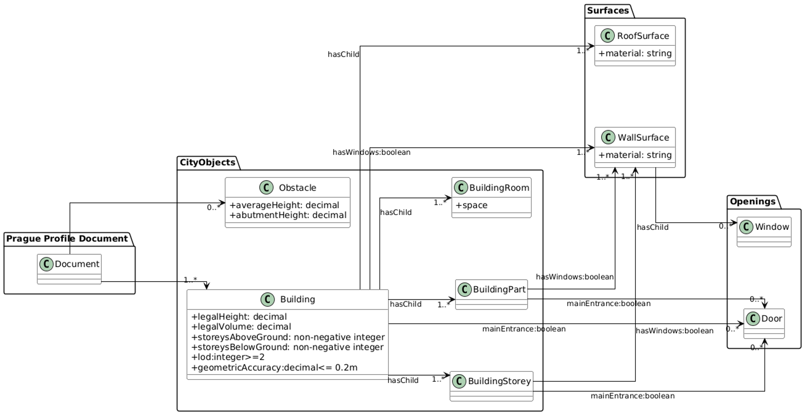

This profile checks that:

* A building of interest exists.
* All buildings fulfill the following criteria:
  * Roofs are present with LoD 2 and up.
  * Walls are preent with LoD 3.1 and up.
  * There is an attribute `hasWindows` set to `true`.

Additionally, rules from the `roads-present` and `green-public-spaces-present` profiles. 

The following UML diagram illustrates all the validation classes and attributes:

